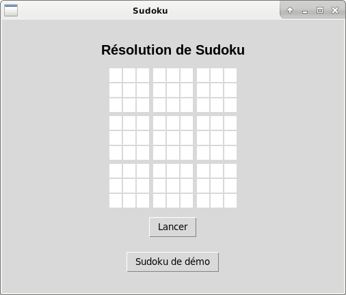

# Solveur de sudoku

## Utilisation
Ce logiciel s'exécute avec Python: `python sudoku.py`

### Pré-requis
Il requiert la présence du module tkinter.
Sur Debian, ce module s'installe par exemple ainsi : `sudo apt install python-tk python-tkfont`

## Apparence
